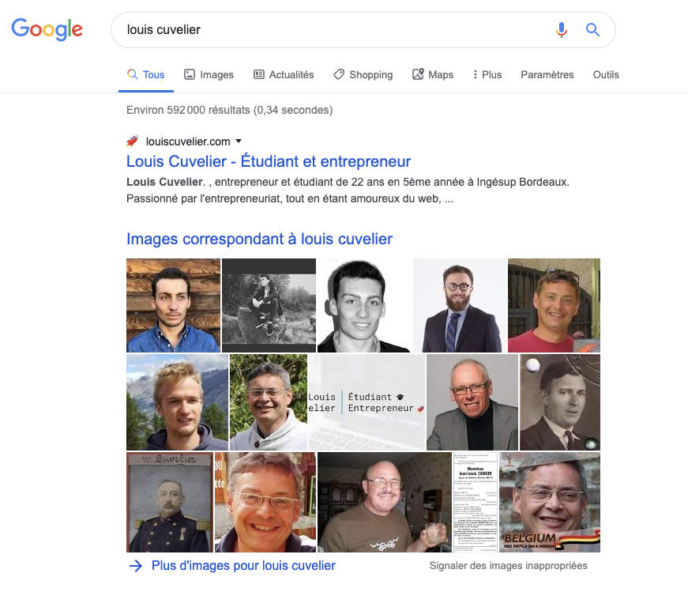

## Faites un audit de votre e-réputation
La première chose à faire est de **rechercher votre nom en navigation privée sur Google**. Cela permet de faire un état des lieux de votre réputation sur internet. Je vous conseille d’être psychologiquement préparé parce que vous risquez de tomber sur des choses assez déplaisantes. En effet, en vous recherchant, vous devriez tomber sur de vieux comptes Ask, Skyblog, Tumblr etc … Vous allez sans doutes aussi trouver quelques photos et ça ne sera pas forcément les plus jolies.

C’est pourquoi **il est important de faire le ménage**. D’autant plus qu’en creusant un peu, le stalking peut vite devenir facile, notamment en retrouvant des pseudos. **On peut alors remonter très loin**. Si vous ne savez pas ce qu’est le stalking et jusqu’où il peut aller, je vous rappelle que l’excellent  [Studio 404 en parle](https://medium.com/@LouisCuvelier/pourquoi-vous-devez-absolument-%C3%A9couter-studio-404-a64517bf811b)  dans l’émission d’Octobre 2016.

Toutefois, si vous avez de la chance, plusieurs personnes portent le même nom et prénom que vous. Grâce aux informations de ces personnes, **les résultats qui vous concerne pourront être éventuellement masqués**. Cependant, en cherchant bien, **ils restent toujours trouvables**. Il faut donc que vous fassiez le ménage dans tous les cas.

## Faites le ménage
Tout d’abord, vous devriez **commencer par supprimer vos vieux comptes** Ask, Skyrock et compagnie. Les résultats liés à ces sites devraient mettre quelques semaines à disparaître de Google.

Ensuite, concernant les plateformes que vous utilisez toujours, il faut **faire attention à vos paramètres de confidentialité**. Ainsi, pour se donner une idée de ce que n’importe qui peut voir vous concernant sur Facebook, allez sur votre profil. Cliquez sur le bouton « … » (situé sur l’image de couverture) et cliquez sur « Aperçu du profil en tant que … ». D’ici, vous avez une vision de tout ce qui est en public et vous pouvez corriger ce qui doit l’être. Pour plus d’information, je vous recommande de lire  [cet article publié par Facebook](https://www.facebook.com/notes/facebook/param%C3%A8tres-de-confidentialit%C3%A9-sur-facebook-les-r%C3%A8gles-dor/515989341767420/) .

De plus, je vous conseille très fortement de **remonter vos différents profils pour supprimer ce qui a besoin de l’être**. Sur Facebook, il y a notamment une fonctionnalité pratique pour faire le tri tous les jours. Il faut que vous alliez sur la page « Ce jour-là » (dans la colonne de gauche sur la page d’accueil ou à  [cette adresse](https://www.facebook.com/onthisday) ). Ainsi, **tous les jours, vous verrez de vieilles publications et autres identifications**. À la base, c’est pour vous rappeler des souvenirs, mais, personnellement, grâce à cette fonctionnalité, je supprime de vieux trucs tous les jours.

Puis, sur Twitter et Instagram, **passez vos comptes en privé si nécessaire**.

Enfin, en dernier recours, vous avez la possibilité de  [demander à Google de supprimer des informations](https://support.google.com/websearch/troubleshooter/3111061?hl=fr)  qui ont été indexé par le moteur de recherche.

## Soignez votre présence sur le web
Le premier moyen de booster son e-réputation est de**soigner sa présentation sur le web**. C’est vraiment quelque chose d’**indispensable si vous voulez faire bonne impression** auprès de n’importe qui et surtout d’un recruteur ou d’une entreprise.

Pour commencer, **bannissez** de ce que vous publiez : **les fautes d’orthographe, de ponctuation et de syntaxe**. Ensuite, **complétez un maximum votre profil LinkedIn et/ou Viadeo**. Puis, ne montrez uniquement que ce qui est à votre avantage ou ce qui est neutre. Enfin, **faites attention à la construction de vos emails** : relisez, corrigez et ajoutez une signature professionnelle.

**Mettez vous à la place de la personne qui fait des recherches sur vous** ou qui lit vos emails. Le jugement d’une personne se fait en quelques secondes. Par conséquent, s’il trouve quelque chose de gênant ou un email bourré de fautes, vous pouvez être sûr que vous serez mal perçu.

## Publiez du contenu
Enfin, selon moi, **le meilleur moyen de renforcer votre e-réputation** ou de cacher ses casseroles **est de publier du contenu intéressant sur internet**. Alors, j’ai dit plus haut que vous aviez de la chance si plusieurs personnes ayant le même nom et prénom que vous. Or, dans le cas où vous publiez du contenu cela peut être problématique. En effet, ces personnes peuvent vous faire de la concurrence. Mais, **il est généralement facile de remonter dans les premiers résultats Google**.

De plus, une autre bonne méthode pour d’élargir votre e-réputation est de **créer un site internet avec un nom de domaine composé de votre nom et prénom**. Par exemple, j’ai créé mon site internet  [louiscuvelier.fr](http://louiscuvelier.fr/) . Ainsi, en 2–3 mois, mon site est apparu en tête quand on recherche «  [Louis Cuvelier](https://www.google.fr/search?q=Louis+Cuvelier)  » sur Google.

Personnellement, j’ai évidemment fait ce travail de nettoyage sur mon nom. Je n’ai donc pas besoin de noyer mes casseroles dans un flot de contenu. Ainsi, **je ne publie pas pour cacher mais pour montrer et par plaisir**.